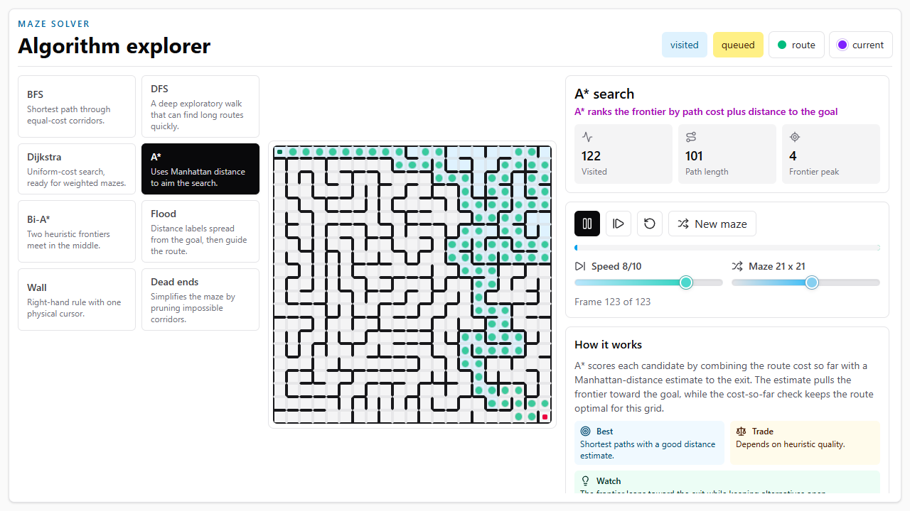

# Maze Solver - Algorithm Explorer

A React + TypeScript visualizer for watching classic maze-solving algorithms work
through the same generated maze. The app is built to make the search behavior
visible: visited cells, queued candidates, active heads, route previews, and the
final path all update frame by frame.



## What it does

- Generates perfect mazes with a seeded recursive backtracker.
- Animates eight solving strategies with playback controls.
- Shows visited cells, queued candidates, current cell, route previews, and final path.
- Compares algorithms by visited cells, path length, and total frames.
- Explains each algorithm with focused notes, trade-offs, complexity notation, and what to watch in the animation.
- Keeps the desktop UI in one workspace with the algorithm picker, maze, controls, comparison table, and details visible together.

## Getting started

```bash
npm install
npm run dev
npm run build
npm test
```

The dev server defaults to `http://localhost:5173`.

## Algorithms

### Breadth-first search

BFS explores the maze in distance layers. In an unweighted maze, the first time it
reaches the goal is guaranteed to be a shortest path. It is dependable, but the
frontier can grow wide.

### Depth-first search

DFS follows one branch as far as possible before backing out. It can find a route
quickly in narrow mazes, but it does not guarantee the shortest route.

### Dijkstra

Dijkstra expands the cheapest known route first. Every corridor currently has the
same cost, so it behaves close to BFS, but the implementation is ready for weighted
movement costs.

### A* search

A* combines route cost with a Manhattan-distance estimate to the goal. The heuristic
pulls the frontier toward the exit while preserving optimal paths for this grid.

### Bidirectional A*

Bidirectional A* runs guided searches from the start and the goal at the same time.
When the frontiers meet, the app stitches the two partial routes together.

### Flood fill

Flood fill builds a distance field from the goal, then walks from the start through
neighboring cells with lower distance labels until it reaches the exit.

### Wall follower

Wall follower behaves like a simple robot keeping one hand on a wall. It uses almost
no memory, but the raw route can be messy before the visualizer cleans it up.

### Dead-end filling

Dead-end filling repeatedly removes corridors that cannot contain the goal. Once
the dead ends are gone, the remaining corridor reveals the solution route.

## Code structure

`src/maze/` contains pure maze logic with no React dependency. `generateMaze.ts`
creates perfect mazes, `grid.ts` handles walls and neighbors, and `solvers/`
contains the algorithm implementations.

`src/components/` contains the UI: maze rendering, playback controls, algorithm
picker, stats, comparison table, and algorithm details.

`src/hooks/` contains reusable React state for animation playback.

## Built with

React, TypeScript, Vite, Tailwind CSS, Lucide icons, and Vitest.
